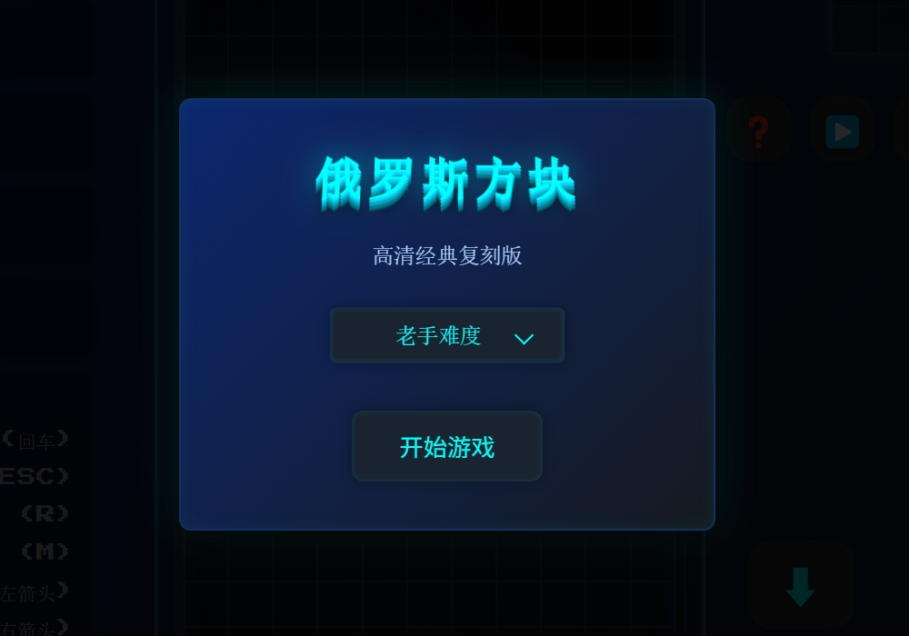
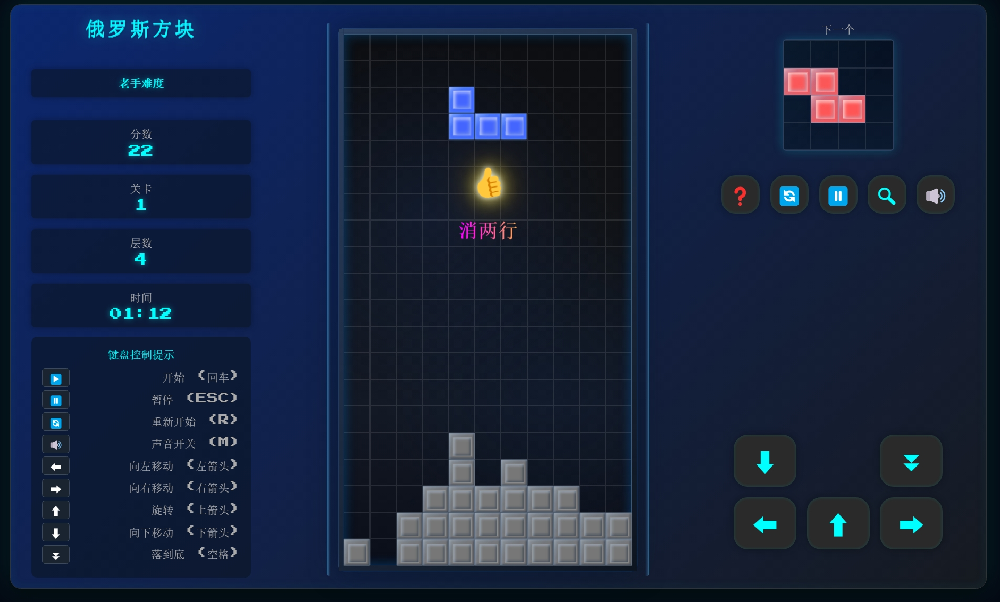
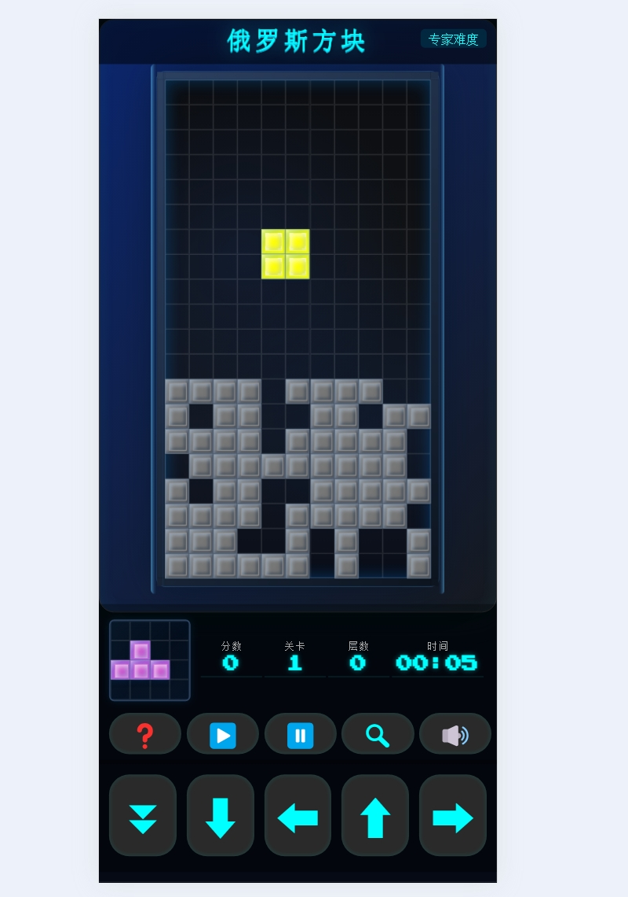
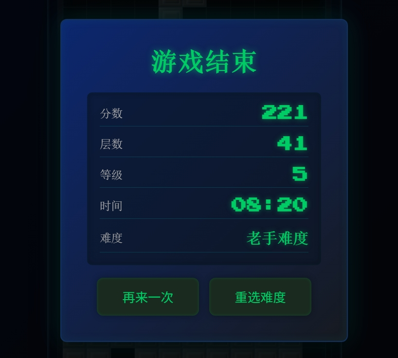

# 俄罗斯方块 AI高清重制摸鱼版

致敬程序员阿列克谢·帕基特诺夫带给全世界人民的欢乐摸鱼时光，我们与AI一起重制了这款经典摸鱼小游戏 **俄罗斯方块 AI高清重制摸鱼版**，今天公益、免费、开源、分享给大家，祝大家摸鱼快乐，人生幸福~ 🎉🧸

In tribute to programmer Alexey Pajitnov, who brought joy and countless delightful slacking-off moments to people around the world, we've teamed up with AI to remake the classic time-killer *Tetris*. Today, we're releasing it as a public good—free, open source, and shared with everyone. Happy slacking, and may your life be filled with happiness! 🎉🧸

## 获取方式

- **GitHub仓库**：[https://github.com/lukechern/tetris](https://github.com/lukechern/tetris)
- **NPM安装**：
  ```
  npm i aitetris
  ```
- **Discuz!插件版**：[https://addon.dismall.com/plugins/tetris.html](https://addon.dismall.com/plugins/tetris.html)

---

## 🎮 游戏特色一：经典玩法、重温回忆、情怀再现  

保留了原版俄罗斯方块的经典操作和得分规则，简单上手却富有挑战，让玩家在熟悉的方块世界里重温童年乐趣。  

Retains the original Tetris classic controls and scoring system, easy to pick up yet challenging, allowing players to relive childhood fun in the familiar world of falling blocks.  

---

## 💪 游戏特色二：多重难度可选、金手指辅助瞄准方块落点  

提供从新手到专家的多种难度模式，满足不同水平玩家的挑战需求；内置金手指辅助功能，可显示方块预测落点，帮助玩家更精准地规划落块策略。  

Offers multiple difficulty modes from beginner to expert to meet the challenge needs of players at different levels; includes a built-in cheat feature that displays the predicted landing position of blocks, helping players plan their block placement more precisely.  

---

## 🌟 游戏特色三：无损高清放大、互动特效、优美音乐、超炫音效  

支持任意比例无损放大，细节清晰锐利；消除时配合精美交互动画与炫酷光效，让每一次连线都焕发新鲜感；配合动听背景音乐与沉浸式音效，带来视觉与听觉的双重享受。🎶🔊  

Supports lossless scaling at any ratio, keeping details crisp and sharp; pairs elegant interactive animations and dazzling visual effects when clearing lines, refreshing every combo; combined with delightful background music and immersive sound effects, delivering a feast for both the eyes and ears. 🎶🔊  

---

## 🎨 游戏特色四：音效、音乐、难度参数数等可自定义  

用户可以自定义游戏音效、背景音乐以及速度、行数目标等多项难度参数，还可调整方块掉落速度和视觉主题，实现个性化的游戏体验。  

Users can customize game sound effects, background music, as well as various difficulty parameters such as speed and line goals; block drop speed and visual themes can also be adjusted, enabling a personalized gaming experience.  

---

## 📱💻 游戏特色五：电脑手机、即开即玩、无需下载、无需安装  

完美适配 Windows、Mac、Android、iOS 等多端设备，只需一键打开网页，即可极速加载，无需任何插件或安装包。随时随地，想玩就玩，真正做到轻量便捷，省时省力。🌐⚡  

Perfectly adapts to multiple platforms including Windows, Mac, Android, and iOS; just open the web page with one click to load instantly without any plugins or installation packages. Play anytime, anywhere—truly lightweight, convenient, and time-saving. 🌐⚡  

---

## 💡 温馨提示：为爱发电，公益分享，没有服务  

本游戏秉承"为爱发电"的公益理念，完全免费开源分享，不提供商业服务与技术支持。如在使用过程中遇到问题，欢迎在社区互助交流，但请理解作者团队无偿维护，感谢大家的理解与支持！🙏  

This game adheres to the public welfare philosophy of "powered by love", completely free, open-source, and shared without providing commercial services or technical support. If you encounter any issues during use, you're welcome to seek help in the community, but please understand that the author team maintains it voluntarily. Thank you for your understanding and support! 🙏  

---

## ❤️ 特别感谢：  

❤️ 衷心感谢以下 AI 与技术团队提供的重要技术支援（排名不分先后）：  

- Claude-3.7-sonnet  
- Gemini-2.5-pro  
- GPT-4o  
- DeepSeek-v3  
- Cursor  
- Trae  
- 通义灵码  

❤️ Sincere thanks to the following AI and technical teams for providing important technical support (in no particular order):  

- Claude-3.7-sonnet  
- Gemini-2.5-pro  
- GPT-4o  
- DeepSeek-v3  
- Cursor  
- Trae  
- 通义灵码  

Your brilliance has made this game even more exciting and splendid! 🚀  

Special thanks to the creators of the free music and sound effects collected from the internet that were used as game assets;  

## 游戏截图

- 欢迎进入游戏卡片 welcome card 


- 电脑版截图 PC screenshot


- 手机版截图 mobile screenshot


- 过关成绩结算卡片success card


- 参数设置页面（这一部分仅限discuz插件版本 https://addon.dismall.com/?@tetris.plugin ，当然如果不用discuz插件版，你也可以在resource\config\config_user_7ree.js中设定参数）Settings Page (This section is only applicable to the Discuz plugin version: https://addon.dismall.com/?@tetris.plugin. Of course, if you're not using the Discuz plugin version, you can also configure the parameters in `resource\config\config_user_7ree.js`.) 


